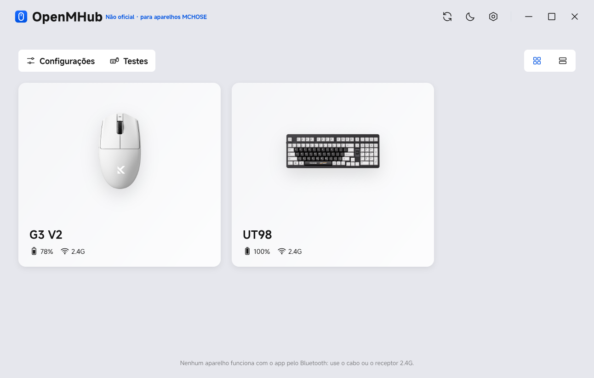
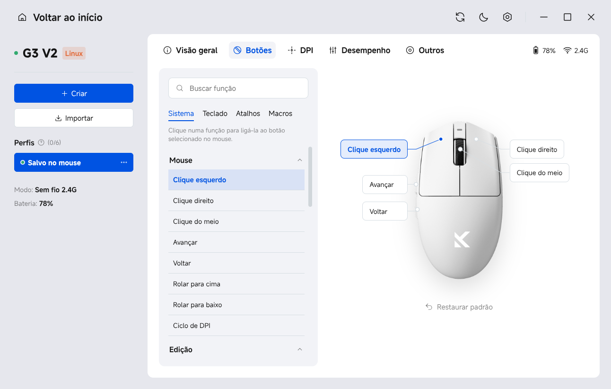
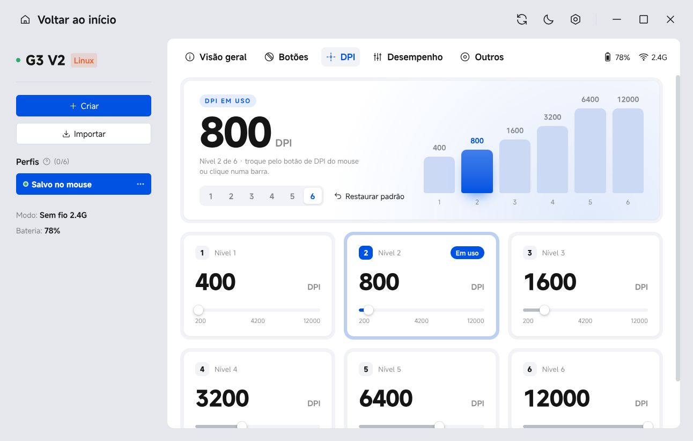
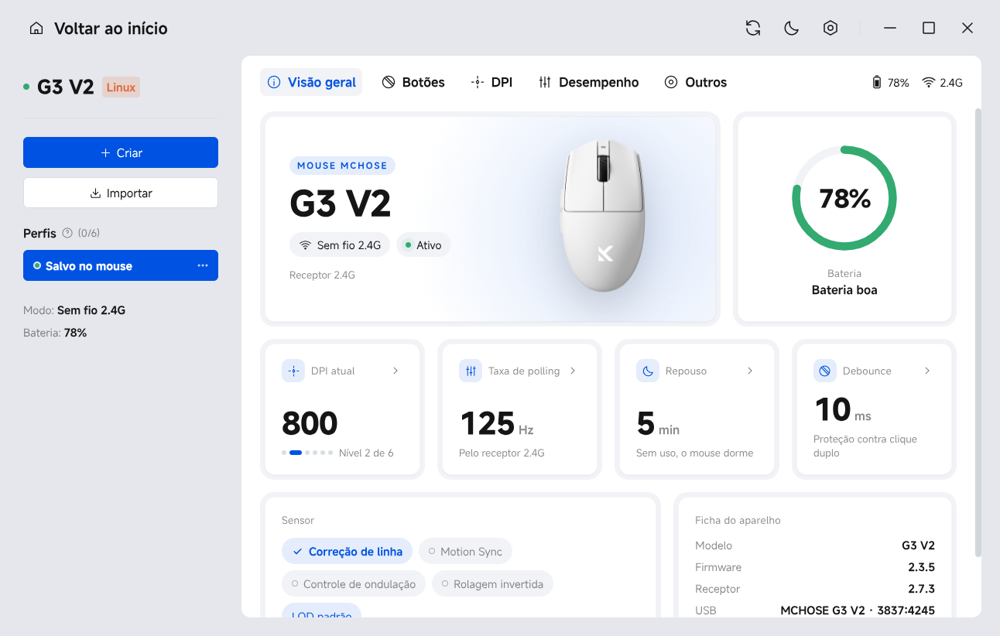
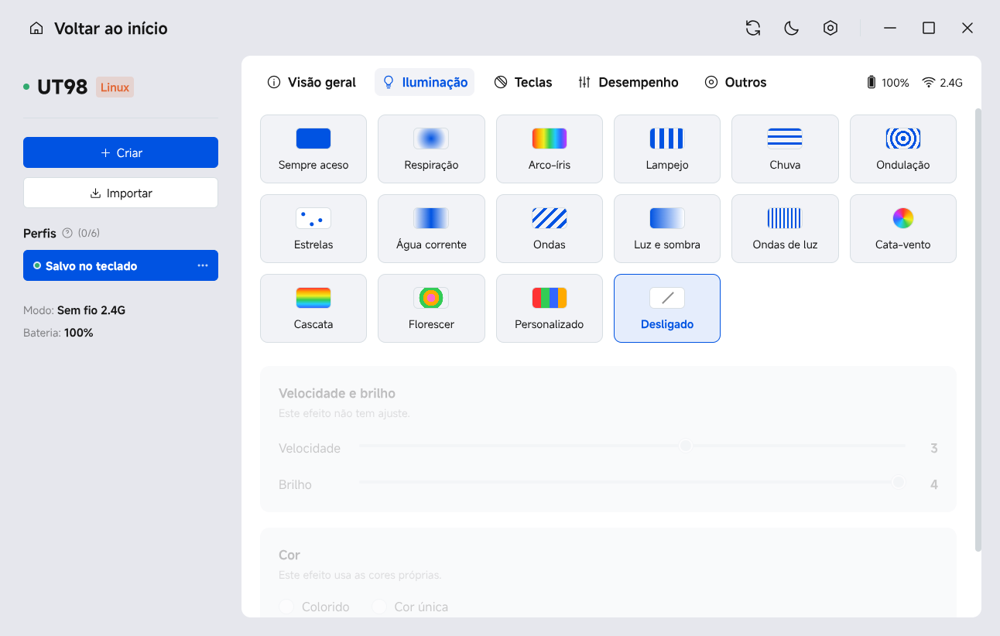

# OpenMHub

An unofficial, open-source Linux configurator for MCHOSE mice and keyboards, built to look and behave like MCHOSE's official M HUB app, which only runs on Windows. (Formerly "M HUB Linux".)

See at a glance how much battery each device has, whether it is charging, and whether it is connected by cable or 2.4G receiver. For supported devices, change the settings stored on the device: buttons, DPI, polling rate, lighting, key remapping and macros.

> **Unofficial — not affiliated with, sponsored or endorsed by MCHOSE.** This is a community project. MCHOSE and M HUB are trademarks of their owner. It talks to the devices with the same HID commands the official M HUB web driver sends; firmware updates are deliberately not supported, so use the official app for those.



| Mouse buttons | Mouse DPI |
|---|---|
|  |  |
| **Device overview** | **Keyboard lighting** |
|  |  |

## Features

**Every MCHOSE device the app recognises**

- Battery level, charging state, and sleeping or offline state
- Connection mode: wired or 2.4G receiver. Like M HUB, the app cannot reach devices connected over Bluetooth.
- Mouse and receiver firmware versions
- The official product picture, with the colour variant you pick on the device card (86 mice, keyboards and headsets in the catalog). Pictures are downloaded from MCHOSE's CDN the first time they are shown and cached; offline, a generic icon is shown instead.

**Mouse settings.** Changes are written to the mouse as soon as you make them, the same way M HUB does it:

- **Buttons:** remap the 5 buttons to mouse functions, media keys, keyboard keys, shortcuts or DPI actions
- **DPI:** 1 to 6 stages, the value of each stage, and the active stage
- **Performance:** polling rate, debounce, LOD, sleep timer, Motion Sync, angle snapping, ripple control and scroll direction
- **Macros:** record keyboard and mouse actions with their delays, pick one of the 4 repeat modes and bind the macro to a button
- **Others:** restore factory settings and the receiver pairing steps

**Keyboard settings**

- Lighting effects, colours and per-key colour
- Key remapping on the normal, Fn and Fn2 layers
- Macros stored on the keyboard (3 repeat modes)
- Sleep timer, Top Speed, Mac mode, Win lock and factory reset
- A JSON backup of the whole configuration

**Also included**

- **Profiles:** up to 6 local profiles per device, like M HUB. Create, rename, apply, and export or import them as JSON. The first row is a full backup of what is stored on the device.
- **Test tools:** keyboard test (key lights, rollover, event log) and mouse test (button counters, abnormal double-click detector, clicks per second, polling-rate estimate).
- **Tray and notifications:** a tray icon with each device's battery, low-battery and full-charge notifications, DPI changes from the mouse button, and Caps/Num/Scroll Lock.
- Light and dark themes, grid and list views of the devices, and M HUB's screen, tab and card animations.

The interface is in Brazilian Portuguese for now. Translations are welcome.

## Supported devices

| Device | USB ID | What works |
|---|---|---|
| MCHOSE G3 V2 over its cable | 3837:418c | Battery, firmware and all mouse settings. When the mouse switch is set to 2.4G, the cable only charges and this interface stays silent. |
| MCHOSE G3 V2 2.4G receiver | 3837:4245 | Battery, charging, online state, firmware and all mouse settings |
| MCHOSE UT98 / G98 V2 keyboard over its 2.4G dongle (Sinowealth) | 41e4:2004 | Battery, charging, sleep state and all keyboard settings |
| MCHOSE UT98 / G98 V2 keyboard over its cable | 41e4:2203 | Implemented from the M HUB source, not yet tested on a real keyboard |

Other MCHOSE devices appear with their picture, but without battery or settings until someone adds a driver for their protocol. See [Adding a device](#adding-a-device).

## Installation

### Flathub

> Coming soon: the Flathub submission is in progress.

```sh
flatpak install flathub io.github.brayanspagnol.OpenMHub
```

A Flatpak cannot install udev rules, so run this once on the host to let the app talk to the devices without root (the app shows the same command when it finds no device), then unplug and replug the receiver or cable:

```sh
printf '%s\n' 'SUBSYSTEM=="hidraw", ATTRS{idVendor}=="3837", MODE="0660", TAG+="uaccess"' 'SUBSYSTEM=="hidraw", ATTRS{idVendor}=="41e4", MODE="0660", TAG+="uaccess"' | sudo tee /etc/udev/rules.d/70-mhub-linux.rules >/dev/null && sudo udevadm control --reload && sudo udevadm trigger --subsystem-match=hidraw
```

In the Flatpak, "Iniciar com o sistema" (start with the system) is not available.

### Installer (any distribution)

Download `MHUB-Linux-Installer.run` from the [latest release](../../releases/latest), then double-click it, or run `sh MHUB-Linux-Installer.run` in a terminal. A small window opens:

1. Click "Instalar". Optionally tick "Iniciar com o sistema" to start the app hidden in the tray when you log in.
2. When it finishes, click "Abrir OpenMHub", or open "OpenMHub" from your application menu.

Some file managers only run the file after you mark it as executable (`chmod +x MHUB-Linux-Installer.run`).

**What the installer does**

- **Electron:** it needs `electron42`. On Arch it installs it with pacman when it is missing, asking for your password in a small window. On other distributions it tells you what to install.
- **udev rule:** it installs a rule in `/etc/udev/rules.d` so the app can talk to the devices without root. That step asks for your password too, and is skipped when the rule is already there.
- **Your home directory:** everything else goes here:
  - the app in `~/.local/share/mhub-linux`
  - the `mhub-linux` launcher in `~/.local/bin`
  - the icons and the menu entry
- **Without a graphical session:** the same installer asks its questions in the terminal (`--terminal`), and `--yes` installs without asking.

**Update and uninstall**

- To update, run a newer installer.
- To uninstall, run the installer again and click "Desinstalar", or run `~/.local/share/mhub-linux/uninstall.sh`. Add `--all` to also remove the udev rule and your preferences.

### Arch Linux

Each release also has an Arch package, built from `packaging/PKGBUILD` (an AUR package may follow). Install it with `sudo pacman -U mhub-linux-*.pkg.tar.zst`. It puts the app in `/usr/lib/mhub-linux`, the launcher in `/usr/bin/mhub-linux` and the udev rule in `/usr/lib/udev/rules.d`.

## Running

Open "OpenMHub" from the application menu, or run `mhub-linux` (`flatpak run io.github.brayanspagnol.OpenMHub` for the Flatpak).

- F12 opens DevTools.
- The Settings page has a debug mode that shows the raw HID responses.

## Desktop integration

- **One copy at a time:** launching the app again brings the existing window to the front.
- **Tray icon:** lists each device with its battery, charging state and connection mode.
  - Clicking it opens the window. Its menu has "Abrir OpenMHub" and "Sair".
  - It needs a StatusNotifierItem host, such as the waybar `tray` module or a KDE/GNOME tray extension.
- **Closing the window:** hides it in the tray, so battery monitoring keeps running. Use "Sair" in the tray menu to quit. Without a tray, closing the window quits the app.
- **Low-battery notification:**
  - It warns when a device that is not charging drops to the threshold (20% by default).
  - It fires once per discharge, and resets when the device charges or goes back above the threshold.
  - An optional notification says when charging reaches 100%.
- **Start with the system:** writes `~/.config/autostart/mhub-linux.desktop`, which starts the app hidden in the tray (`mhub-linux --hidden`).
  - Desktops that follow the XDG autostart spec pick this up.
  - Hyprland ignores that folder, so the app also adds one line marked `mhub-linux-autostart` to `~/.config/hypr/hyprland.lua` (or `hyprland.conf`). It removes the line when you turn the option off. The first edit saves a backup next to the file with the `.mhub-bak` suffix.
  - Other bare compositors need `exec-once = mhub-linux --hidden`, or its equivalent, in their config.
- **Preferences:** saved in `~/.config/mhub-linux/prefs.json` (in the Flatpak, `~/.var/app/io.github.brayanspagnol.OpenMHub/config/mhub-linux/`). Downloaded product pictures are cached in `device-images/` next to it.
- **Window class:** the Wayland app id is `mhub-linux`, matching the desktop entry (`io.github.brayanspagnol.OpenMHub` in the Flatpak).

## Development

The app is plain JavaScript on Electron: no build step and no npm dependencies. You only need `electron42`.

```sh
git clone https://github.com/brayanspagnol/OpenMHub.git
cd MHUB
sudo cp udev/70-mhub-linux.rules /etc/udev/rules.d/ && sudo udevadm control --reload && sudo udevadm trigger
./mhub-linux            # run from the checkout, nothing is installed
```

- **Install from the checkout:** `./install.sh` installs with the same layout as the installer. `--gui` opens the installer window and `--help` lists the options. `./uninstall.sh` removes it.
- **Build release files:** `packaging/build-installer.sh` builds `dist/MHUB-Linux-Installer.run` and, when `makepkg` is available, the Arch package from `packaging/PKGBUILD`.
- **Only one instance runs at a time.** If the installed app is open, `./mhub-linux` just brings it to the front: quit it from the tray first.

### Project layout

| Path | What it is |
|---|---|
| `app/main.js` | Electron main process: frameless window, WebHID permissions, tray, notifications, preferences and the `mhub-img://` protocol that downloads and caches product pictures |
| `app/preload.js` | The `window.mhub` bridge between the UI and the main process |
| `app/renderer/app.js` | Screens (home, device page, settings) and device polling |
| `app/renderer/drivers/` | One driver per protocol: `g3v2.js` (G3 V2 mouse), `sinowealth.js` (UT98 / G98 V2 keyboard), `base.js` (shared HID request/response code) |
| `app/renderer/views/` | Device tabs: `mouse.js`, `keyboard.js`, `macros.js`, `profiles.js`, `tester.js` |
| `app/renderer/data/` | Tables taken from M HUB: mouse button functions, the UT98 key layout, and the device catalog |
| `app/renderer/device-images.js` | Finds the picture and colours of a device in `data/device-catalog.js` |
| `app/renderer/assets/devices/generic/` | Generic mouse, keyboard and receiver icons, shown when a device has no picture or the picture cannot be downloaded |
| `tools/fetch-device-assets.py` | Rebuilds the device catalog (with each picture's CDN URL) from M HUB's web app and remote config: `uv run --with pillow tools/fetch-device-assets.py`. Run it again when MCHOSE releases new products. |
| `udev/`, `install.sh`, `uninstall.sh`, `packaging/` | udev rule, install scripts, GTK installer, desktop entry, PKGBUILD and `build-installer.sh` |

### Adding a device

1. **Grant access to the device:**
   - add its USB vendor and product ID to `udev/70-mhub-linux.rules`;
   - add them to the `VENDORS` list in `app/main.js`.
2. **Write the driver:** add a driver in `app/renderer/drivers/` that extends `HidDriver` from `base.js`.
   - `match(vendorId, productId)` claims the device.
   - `poll()` returns `{ online, battery, charging, mode }`. That alone gives the device its card, battery and tray entry.
3. **Register it:** add the driver to `app/renderer/drivers/index.js`.
4. **Settings:** add them once the status works.

M HUB groups MCHOSE devices into a few protocol families. Each family needs one driver, not one per model:

- **Mice:** FRK (G3, G3 V2, G7, A7e), RY (M7, L7, A7, K7) and NDK (A5 V3, A7 V3, K7 V2, G3 V3).
- **Keyboards:** BY, the Sinowealth boards (K99, G98, G87, X75, UT98…), and CZ, the magnetic Ace, Jet and Mix boards.

The drivers here cover one model each of FRK and BY. Please test on real hardware and open an issue or pull request with what works.

## Versioning and releases

The project follows [Semantic Versioning](https://semver.org/). The version lives in one place, `app/package.json`; the PKGBUILD, the installer and the app read it from there. Changes are listed in [CHANGELOG.md](CHANGELOG.md).

To make a release:

1. Set the new version in `app/package.json`.
2. Move the `Unreleased` entries in `CHANGELOG.md` under the new version and date.
3. Commit, then tag: `git tag -a v0.2.0 -m "v0.2.0"` and `git push --follow-tags`.
4. Run `packaging/build-installer.sh`, and attach `dist/MHUB-Linux-Installer.run` and the Arch package to the GitHub release for the tag.

## How this project was built

Most of the code, packaging and documentation in this repository was written with the help of an AI coding assistant (Claude), directed and tested by the maintainer on real hardware. The device protocols come from studying MCHOSE's own web configurator. Please report anything that looks wrong.

## License

The source code is released under the [MIT License](LICENSE).

These files are not covered by that license and belong to their owners:

- **Product pictures**: © MCHOSE. They are not bundled: the app downloads them from MCHOSE's public CDN at run time and caches them locally, so devices look the same as in M HUB. The generic icons in `app/renderer/assets/devices/generic/` also come from M HUB.
- **MiSans fonts** in `app/renderer/assets/fonts/`: © Xiaomi, distributed under the MiSans font license.

If you are a rights holder and want any of them removed, please open an issue.
